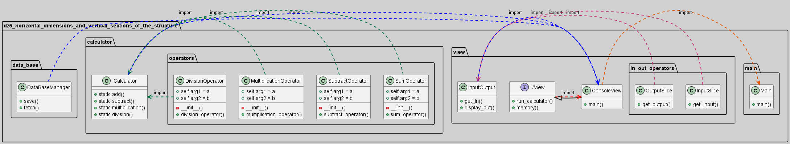

Приложение разбито на 3 горизонтальных слоя и точку входа:
1. data_base (работа с памятью)
2. calculator (основная логика)
3. view (пользовательский интерфейс для работы с программой)

Вертикальные срезы можно проследить по стрелочкам