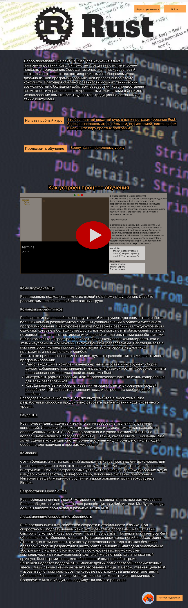
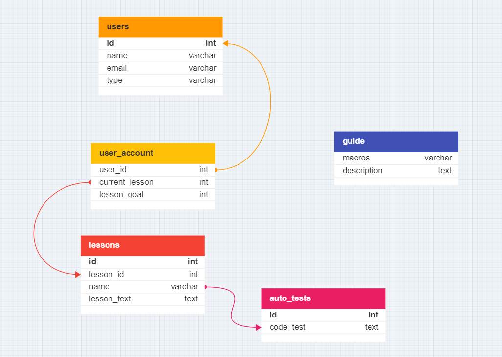

# Макет сайта по обучению языка программирования Rust

### Схема общей структуры сайта

На главной странице пользователь имеет возможность:
1. посмотреть видео-презентацию как будет проходить учебный процесс
2. опробовать пробный курс, чтобы чуть подробнее ознакомиться с процессом
3. зарегистрироваться и/или пройти в личный кабинет
4. обратиться в службу поддержки во имеющимся вопросам

Пройдя регистрацию и оплатив курс, пользователь получит доступ к самому обучению,
где ему будет предоставлены возможности:
1. узнать историю и возможности языка
2. выполнение практических задач
3. обсуждение задач с другими учениками и преподавателями

По окончанию обучения пользователь получит сертификат об окончании обучения. 

Так же доступ к сайту имеют преподаватели и администраторы через соответствующие 
учетки и правами доступа для выполнения своих рабочих задач.

### Пример главной страницы сайта

Как и описывалось выше, пользователю доступны видео с ознакомлением, пробный курс, 
войти в личный кабинет, регистрация на сайте и обратиться в службу поддержки. 

### Пример рабочей страницы

В левой части экрана, под логотипом языка, иконки:
- книжка - перейти на страницу со справочным материалом
- блокнот с ручкой - откроется блокнот для собственных заметок

Чуть правее расположено окно с переключателями:
- "Привет, мир!" - кнопка не имеет собственного названия и вызывает план занятий. Пользователь может посмотреть какие уроки он прошел и какие его ожидают. Название кнопки отражает название текущего урока.
- "Терминал" - тут выводится результат кода
- "Обсуждение" - откроет чат текущего урока для обсуждения с другими пользователями
- "Древо файлов" - откроет окно, где будет видно структуру папок и файлов

В правом верхнем углу расположена иконка для перехода в личный кабинет.

Ниже расположен редактор кода, куда пользователь пишет код и может его запустить, остановить или запустить пошагово

В нижней части страницы расположена структура автотеста, чтобы пользователю было более понятно что он него ждут и как будет проверяться код 

### Пример базы данных

Взаимосвязь между пользователем и пройденными уроками.
Программа отслеживает пройденный материал чтобы не выдать сертификат раньше,
а также, чтобы пользователь не мог перейти на поздние уроки, не пройдя предыдущие.  

___

___

1.1 Определение целей и задач приложения:
- Основная цель: Создать сайт для обучения основам и синтаксису языка программирования Rust.
- Задачи:
  - Разработать удобный и понятный интерфейс для работы с кодом и материалом для изучения.
  - Реализовать систему автотестов для качественной проверки заданий.
  - Создать систему общения между пользователями и преподавателем, для решения сложных задач.

1.2 Анализ аудитории и исследование рынка:
- Целевая аудитория: Люди всех возрастов, интересующиеся языком программирования Rust.
- Исследование рынка: Проанализированы другие обучающие сайты и он-лайн школы, определены их особенности и недостатки.

1.3 Создание общего описания концепции и функциональности:
- Концепция: Объяснить и научить максимально доступным и простым языком со множеством интересных задач.
- Основные функции:
  - Редактирование и запуск кода.
  - Проверка автотестами.
  - Безопасность и изолированность использования.
  - Система авторизации и возможность просмотра ранее пройденных уроков.

1.4 Выбор бизнес-модели:
- Модель монетизации: Продажа курса по срочной и без срочной подпискам.

1.5 Оценка ресурсов и бюджета:
- Ресурсы: Доступен бюджет для найма разработчиков, дизайнеров и рекламных кампаний.
- Бюджет: Оценка расходов на разработку, дизайн, маркетинг и обслуживание приложения.

1.6 Планирование времени:
- Временной график:
  - Определение требований и разработка концепции: 6 месяцев.
  - Проектирование интерфейса и прототипирование: 3 недели.
  - Разработка фронтенда и бэкенда: 4 месяцев.
  - Тестирование и доработка: 3 недели.
  - Деплой и подготовка к запуску: 1 неделя.

1.7 Проектирование прототипа:
- Создание прототипа интерфейса с основными элементами:
  - Главная страница с возможностью ознакомления.
  - Страница с обучающим приложением.
  - Страница авторизации и регистрации.
  - Страница со справочником.
  - Пользовательский чат. 